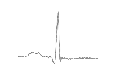
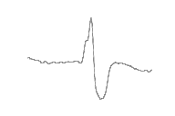
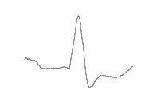
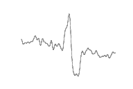
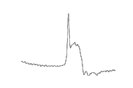
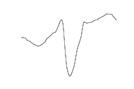
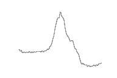
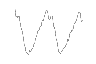

# ECG_MIT_BIH_Arryhthmia_2D_CNN
Use 2D-CNN to deal with mit_bih_arryhthmia dataset (python)
## enviroment
python 3.6
keras==2.2.4
tensorflow==1.14.0
numpy
pandas
tqdm
opencv-python
sklearn
wfdb

## step 1 
down load the mit-bih-arryhthmia dataset and unzip it (you may get a fileholder named mit-bih-arrhythmia-database-1.0.0)
## step 2
python data_preprocess.py
## step 3
python split_train_test_dataset.py
## step 4
python train.py
## step 5
python predict.py

### ECG Classes

